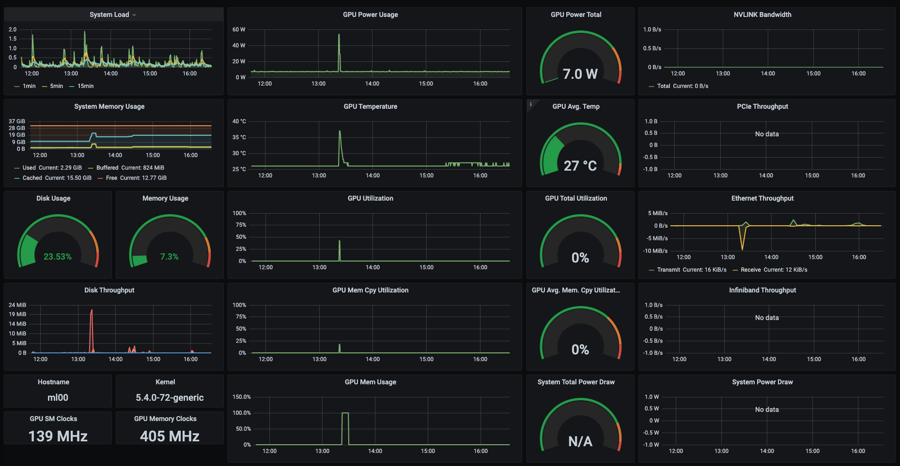
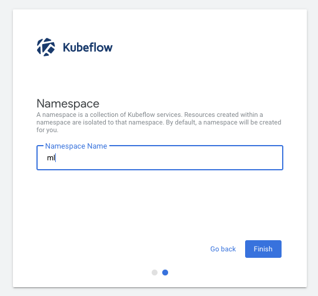
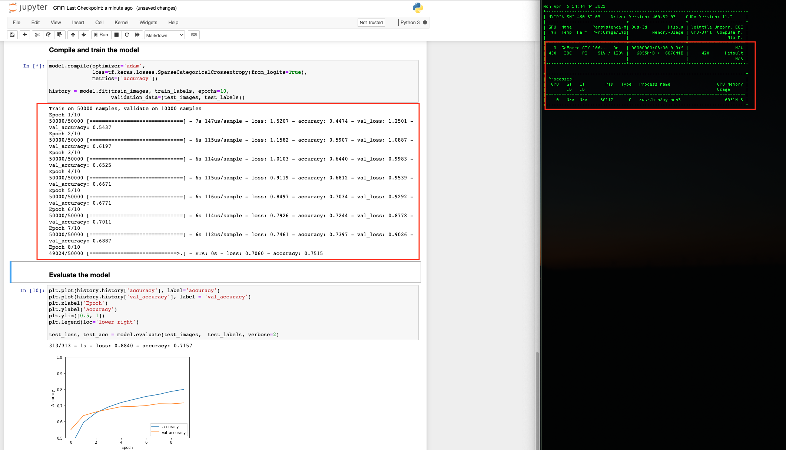
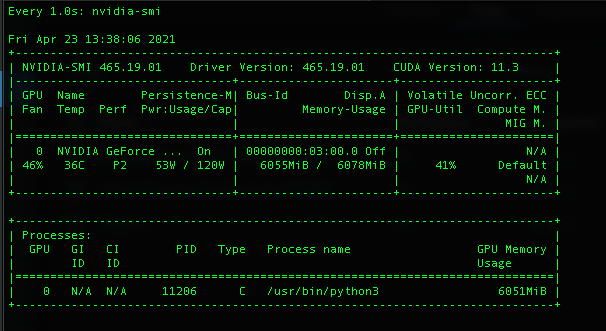

# kubeflow-1.2-GPU
This setup is based of components:
- NVIDIA's DeepOps Configuration
- Rook-Ceph Storage
- Istio Service Mesh
- MetalLB
- Prometheus Monitoring

## Setup Nodes
### Ensure vgs and lvs extended (my personal setup)
```
$ lvextend -l +100%FREE /dev/mapper/ubuntu--vg-ubuntu--lv  -r
```
- Configure DNS or make host files consistent across all nodes
- Ensure all Blockstorage devices are wiped (no partitions no filesystems) - Ceph Requirement

## Install the prerequisites and configure Ansible.
```
cd deepops/
$ ./scripts/setup.sh
```

## Installing Kubernetes with DeepOps
```
vi config/inventory (add cluster nodes)
$ ansible-playbook -l k8s-cluster -e '{"nvidia_driver_ubuntu_install_from_cuda_repo": yes}' playbooks/k8s-cluster.yml -K
```
##  Rook-Ceph
```
cd rook-ceph/
$ kubectl create -f crds.yaml -f common.yaml -f operator.yaml
```
### changes made to cluster.yaml
```
   nodes:
    - name: "worker00"
      devices: # specific devices to use for storage can be specified for each node
      - name: "nvme0n1" # multiple osds can be created on high performance devices
    - name: "worker01"
      devices: # specific devices to use for storage can be specified for each node
      - name: "nvme0n1" # multiple osds can be created on high performance devices
    - name: "worker02"
      devices: # specific devices to use for storage can be specified for each node
      - name: "nvme0n1" # multiple osds can be created on high performance devices
$ kubectl create -f cluster.yaml
```
### Wait for pods to stand up
```
$ kubectl create -f csi/rbd/storageclass.yaml

$ kubectl get storageclass
NAME                        PROVISIONER                  RECLAIMPOLICY   VOLUMEBINDINGMODE   ALLOWVOLUMEEXPANSION   AGE
rook-ceph-block (default)   rook-ceph.rbd.csi.ceph.com   Delete          Immediate           true                   7h49m

kubectl create -f toolbox.yaml 
kubectl exec -it rook-ceph-tools-xxxxxx  -n rook-ceph /bin/bash
# ceph status
  cluster:
    id:     dea324ce-ec4d-4a24-b758-501203c2319f
    health: HEALTH_WARN
            mons are allowing insecure global_id reclaim
 
  services:
    mon: 3 daemons, quorum a,b,c (age 7h)
    mgr: a(active, since 7h)
    osd: 3 osds: 3 up (since 7h), 3 in (since 7h)
 
  data:
    pools:   2 pools, 33 pgs
    objects: 378 objects, 966 MiB
    usage:   5.6 GiB used, 5.5 TiB / 5.5 TiB avail
    pgs:     33 active+clean

#ceph osd status
ID  HOST       USED  AVAIL  WR OPS  WR DATA  RD OPS  RD DATA  STATE      
 0  worker01  1903M  1861G      0        0       0        0   exists,up  
 1  worker02  1903M  1861G      0        0       0        0   exists,up  
 2  worker00  1903M  1861G      0        0       0        0   exists,up  
```

## Installing Istio
```
cd istio-1.6.8/
./bin/istioctl install --set profile=demo
```

## Load Balancer
### Modify config/helm/metallb.yml to configure the IP range that the load balancer will hand out.
### Run the script to deploy the load balancer:

```
cd deepops/
./scripts/k8s/deploy_loadbalancer.sh
```

## Monitoring
### Deploy Prometheus and Grafana to monitor Kubernetes and cluster nodes:

```
cd deepops/
./scripts/k8s/deploy_monitoring.sh
```
Node Monitor



##  Kubeflow Install (Istio components removed from yaml as it installed 1.3.x)
```
cd hello-kf/
file> kfctl_k8s_istio.v1.2.0.yaml
dir> kustomize
$ kfctl apply -V -f kfctl_k8s_istio.v1.2.0.yaml 
```

## Istio 1.6 Kubeflow Fix for UI
```
cd hello-kf/
cd .cache/manifests/manifests-1.2.0/istio/
kubectl apply -f add-anonymous-user-filter-istio-1.6/envoy-filter.yaml
```

## Add kubeflow-gateway (default for app)
```
kubectl apply -n kubeflow -f - <<EOF
apiVersion: networking.istio.io/v1alpha3
kind: Gateway
metadata:
  name: kubeflow-gateway
spec:
  selector:
    istio: ingressgateway # use Istio default gateway implementation
  servers:
  - port:
      number: 80
      name: http
      protocol: HTTP
    hosts:
    - '*'
EOF
```

Create Namespace In Kubeflow



## After creating 'ml' namespace via KF UI (cat ~/ml-default-editor.yaml)
### this needs less permissoins. fix this
```
kubectl apply -f - <<EOF
apiVersion: rbac.authorization.k8s.io/v1beta1
kind: ClusterRoleBinding
metadata:
  name: ml-ns-rbac
subjects:
  - kind: ServiceAccount
    name: default-editor
    namespace: ml
roleRef:
  kind: ClusterRole
  name: cluster-admin
  apiGroup: rbac.authorization.k8s.io
EOF
```

--------------------

## Testing
```
$ kubectl run gpu-test --rm -t -i --restart=Never --image=nvcr.io/nvidia/cuda:10.1-base-ubuntu18.04 --limits=nvidia.com/gpu=1 nvidia-smi
Fri Apr 23 03:06:41 2021       
+-----------------------------------------------------------------------------+
| NVIDIA-SMI 465.19.01    Driver Version: 465.19.01    CUDA Version: 11.3     |
|-------------------------------+----------------------+----------------------+
| GPU  Name        Persistence-M| Bus-Id        Disp.A | Volatile Uncorr. ECC |
| Fan  Temp  Perf  Pwr:Usage/Cap|         Memory-Usage | GPU-Util  Compute M. |
|                               |                      |               MIG M. |
|===============================+======================+======================|
|   0  NVIDIA GeForce ...  On   | 00000000:03:00.0 Off |                  N/A |
| 46%   25C    P8     7W / 120W |      1MiB /  6078MiB |      0%      Default |
|                               |                      |                  N/A |
+-------------------------------+----------------------+----------------------+                                                                              
| Processes:                                                                  |
|  GPU   GI   CI        PID   Type   Process name                  GPU Memory |
|        ID   ID                                                   Usage      |
|=============================================================================|
|  No running processes found                                                 |
+-----------------------------------------------------------------------------+
pod "gpu-test" deleted
```

### Check GPU Labels
```
k describe node ml00 | less

Name:               ml00
Roles:              <none>
Labels:             beta.kubernetes.io/arch=amd64
....
                    nvidia.com/cuda.driver.major=465
                    nvidia.com/cuda.driver.minor=19
                    nvidia.com/cuda.driver.rev=01
                    nvidia.com/cuda.runtime.major=11
                    nvidia.com/cuda.runtime.minor=3
                    nvidia.com/gfd.timestamp=1619147692
                    nvidia.com/gpu.compute.major=6
                    nvidia.com/gpu.compute.minor=1
                    nvidia.com/gpu.count=1
                    nvidia.com/gpu.family=pascal
                    nvidia.com/gpu.memory=6078
                    nvidia.com/gpu.product=NVIDIA-GeForce-GTX-1060-6GB
                    nvidia.com/mig.strategy=mixed

Capacity:
...
  pods:               110
Allocatable:
...
  nvidia.com/gpu:     1
  pods:               110
```

## Training

### Create a GPU enabled notebook and test with a CNN example to leverage GPU




------------------------


## Tear Down

###  Remove Kubeflow
```
$ kfctl delete -V -f kfctl_k8s_istio.v1.2.0.yaml  --force-deletion
```
###  Remove Istio
```
./bin/istioctl manifest generate --set profile=demo | kubectl delete --ignore-not-found=true -f -
```

###  Remove Rook-Ceph
```
Remove all PVC and PV
Reverse Order Deletion Of Install Yamls
kubectl delete -f xxxx.yaml
```

###   Destory/Reset Cluster
```
ansible-playbook submodules/kubespray/reset.yml  -K
```
-----------------------

